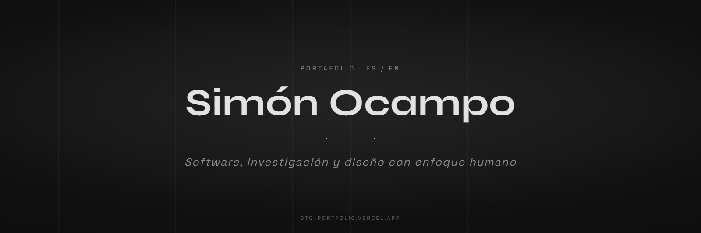

<p align="center">
  
</p>

<p align="center">
  
  
  
  
  
</p>

<p align="center">
  <a href="https://sto-portfolio.vercel.app"><b>Ver el sitio</b></a> &nbsp;•&nbsp;
  <a href="#características">Características</a> &nbsp;•&nbsp;
  <a href="#stack">Stack</a> &nbsp;•&nbsp;
  <a href="#estructura">Estructura</a> &nbsp;•&nbsp;
  <a href="#puesta-en-marcha">Puesta en marcha</a> &nbsp;•&nbsp;
  <a href="#decisiones">Decisiones</a>
</p>

Portafolio bilingüe con proyectos de desarrollo, competencias técnicas y publicaciones de investigación en filosofía de la religión y teología analítica. Es un sitio estático servido en Vercel, con una única función serverless para el formulario de contacto: no hay base de datos ni backend que mantener, y el sitio entero se puede abrir desde el sistema de archivos.

## Características

- **Bilingüe de verdad.** El cambio ES/EN no traduce solo los textos: también intercambia las portadas de cada proyecto, porque varias llevan el texto embebido en la imagen. Traducir la página y dejar las capturas en el otro idioma es el error que este mecanismo evita.
- **Carruseles horizontales.** La rueda del mouse navega el carrusel mientras el cursor está dentro de su área, y le devuelve el scroll a la página al salir.
- **Lightbox de imagen y video** a pantalla completa, con controles de reproducción y una vista horizontal pensada para móvil.
- **Movimiento con GSAP y Lenis.** ScrollTrigger para las revelaciones, botones magnéticos y una previsualización de proyecto que sigue al cursor.
- **CV descargable** en español y en inglés, servido desde el propio repo.

## Stack

| Capa | Tecnología | Por qué |
|---|---|---|
| Página | HTML5 estático | Un portafolio son secciones fijas: pre-renderizarlas evita todo un runtime para mostrar texto e imágenes |
| Estilos | Tailwind CSS 3 compilado | Los tokens viven en `tailwind.config.js`; se compila a un `styles.css` minificado, sin CDN en producción |
| Interacción | JavaScript ES6+ sin framework | i18n, carruseles y lightbox son un archivo; un framework acá sería peso sin contrapartida |
| Animación | GSAP + ScrollTrigger + Lenis | Scroll con timeline real, que es lo que separa el efecto editorial del `scroll-behavior: smooth` |
| Contacto | Función serverless en Vercel + Resend | Una sola función para el formulario: menos superficie que un backend propio y sin servidor encendido |

## Estructura

```
index.html               Marcado semántico de la página completa
assets/
  css/input.css          Fuente de Tailwind y capas del sistema de diseño
  css/styles.css         CSS compilado y minificado para producción
  js/main.js             i18n, carruseles, lightbox, GSAP y Lenis
  cv/                    cv-es.pdf · cv-en.pdf
  img/projects/          Piezas visuales por proyecto, en ambos idiomas
api/send-email.js        Función serverless del formulario de contacto
tailwind.config.js       Tokens de diseño · DESIGN.md  Decisiones de diseño
vercel.json              Configuración de despliegue
```

## Puesta en marcha

Requiere Node 18 o superior.

```bash
git clone https://github.com/SimonOcampo1/professional-portfolio.git
cd professional-portfolio
npm install
npm run watch:css
```

Con el CSS compilándose, servir la carpeta con cualquier servidor estático —`npx serve .`, `python -m http.server`, Live Server de VS Code— y abrir el puerto que indique.

| Comando | Qué hace |
|---|---|
| `npm run watch:css` | Recompila Tailwind al vuelo durante el desarrollo |
| `npm run build:css` | Compila y minifica `styles.css` para producción |

> [!IMPORTANT]
> No hay servidor de desarrollo: los scripts solo compilan Tailwind. Si editás clases y no ves cambios, lo primero a revisar es que `watch:css` esté corriendo.

> [!NOTE]
> El formulario de contacto vive en `api/send-email.js` y solo se ejecuta en Vercel. En local hace falta `vercel dev` para probarlo.

## Decisiones

**Monocromo por decisión, no por falta de paleta.** Grafito `#131313` y blanco, sin radios de borde en ningún componente salvo los elementos circulares. Con las portadas de los proyectos aportando todo el color, una paleta propia compitiría con ellas. El sistema completo está en [`DESIGN.md`](DESIGN.md).

**El idioma es estado, no una segunda página.** Un `/en` duplicado obliga a mantener dos árboles de HTML sincronizados; acá el idioma es una clave que recorre textos e imágenes, y agregar un proyecto es tocar un solo lugar.
