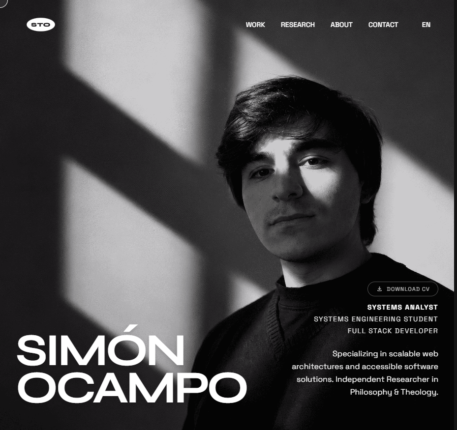

# Simón Ocampo — Portafolio profesional

[](https://developer.mozilla.org/docs/Web/HTML)
[](https://tailwindcss.com)
[](https://gsap.com)
[](https://vercel.com)

> Software, investigación y diseño con enfoque humano.



**[Ver el sitio →](https://sto-portfolio.vercel.app)**

Portafolio bilingüe (ES/EN) con proyectos de desarrollo, competencias técnicas y publicaciones de investigación en filosofía de la religión y teología analítica. Sitio estático servido en Vercel, con una única función serverless para el formulario de contacto.

## Características

- **Bilingüe completo.** El cambio de idioma no traduce solo los textos: también intercambia las portadas de cada proyecto, porque varias llevan texto embebido en la imagen.
- **Carruseles horizontales.** La rueda del mouse navega el carrusel mientras el cursor está dentro de su área, sin robarle el scroll a la página.
- **Lightbox de imagen y video.** Pantalla completa con controles de reproducción y una vista horizontal optimizada para móvil.
- **Scroll y movimiento.** Lenis para el desplazamiento, GSAP con ScrollTrigger para las revelaciones y micro-interacciones.
- **CV descargable** en español e inglés.

## Estructura

```
index.html               Estructura y marcado semántico de la página
assets/
  css/input.css          Fuente de Tailwind y capas del sistema de diseño
  css/styles.css         CSS compilado y minificado para producción
  js/main.js             i18n, carruseles, lightbox, GSAP y Lenis
  cv/                    cv-es.pdf · cv-en.pdf
  img/projects/          Piezas visuales por proyecto
api/send-email.js        Función serverless del formulario de contacto
vercel.json              Configuración de despliegue
tailwind.config.js       Tokens de diseño
DESIGN.md                Decisiones de diseño
```

## Cómo correrlo

Requiere Node 18 o superior.

```bash
git clone https://github.com/SimonOcampo1/professional-portfolio.git
cd professional-portfolio
npm install
npm run watch:css
```

Con el CSS compilándose, servir la carpeta con cualquier servidor estático —Live Server de VS Code, `npx serve .`, `python -m http.server`— y abrir el puerto que indique.

| Comando | Qué hace |
|---|---|
| `npm run watch:css` | Recompila Tailwind al vuelo durante el desarrollo |
| `npm run build:css` | Compila y minifica `styles.css` para producción |

> [!IMPORTANT]
> No hay servidor de desarrollo: el proyecto es HTML estático y los scripts solo compilan Tailwind. Si editás clases y no ves cambios, revisá que `watch:css` esté corriendo.

> [!NOTE]
> El formulario de contacto usa `api/send-email.js`, una función serverless de Vercel. En local no se ejecuta salvo que uses `vercel dev`.

## Stack

HTML5 y JavaScript ES6+ sin framework · Tailwind CSS · GSAP con ScrollTrigger · Lenis · Google Material Symbols · Tipografías Syne y Space Grotesk.
